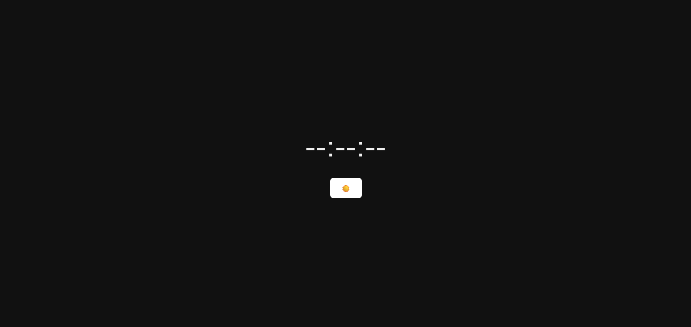

<h4 align="center"> TmeLine</h4>

TimeLine is a modern digital clock website designed with a clean, minimal interface and responsive layout. Built using HTML, CSS, and JavaScript, it presents the current time in a sleek and elegant way while offering a convenient dark/light theme toggle for a personalized viewing experience.

## 💡 Technologies

  
  
  

## 📍 Access the Site

Visit the project live at .

## Author

<table>
  <tr>
    <td align="center">
      <a href="https://github.com/ampofokwadwo">
        
         
        <b>Kwadwo Ampofo</b>
      </a>
       
      <a href="https://github.com/ampofokwadwo" title="Code">💻</a>
    </td>
  <tr>
</table>

---

Feel free to star ⭐ this repository if you like what you see 😉.
